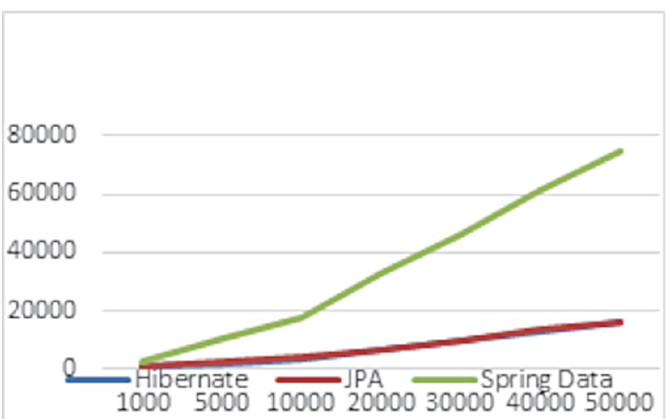

= Java Persistence with Spring Data and Hibernate

IMPORTANT: JDK v21

== Links

- https://github.com/ctudose/java-persistence-spring-data-hibernate[GitHub Book]

== Understanding ORM and Persistence, _Concepts_

* SQL is used as a data definition language *(DDL)*, with syntax for creating, altering, and dropping artifacts such as tables and constraints in the catalog of the DBMS.

* When this schema is ready, you can use SQL as a data manipulation language *(DML)* to perform operations on data, including insertions, updates, and deletions.

* You can retrieve data by executing data query language *(DQL)* statements with restrictions, projections, and Cartesian products; when your business requirements change, you’ll have to modify the database schema again with DDL statements after data has been stored; this is known as schema evolution.

* You may also use SQL as a data control language *(DCL)* to grant and revoke access to the database or parts of it

[%header,cols=2*]
|===
|Framework
|Characteristics

|JPA
|
. Uses the general JPA API and requires a persistence provider.

. We can switch between persistence providers from the configuration.
. Requires explicit management of the EntityManagerFactory, EntityManager,
and transactions.

. The configuration and the amount of code to be written is similar to the native Hibernate
native approach.

. We can switch to the JPA approach by constructing an EntityManagerFactory from
a native Hibernate configuration.

|Native Hibernate
|
. Uses the native Hibernate API. You are locked into using this chosen framework.

. Builds its configuration starting with the default Hibernate configuration files
(hibernate.cfg.xml or hibernate.properties).

. Requires explicit management of the SessionFactory, Session, and transactions.

. The configuration and the amount of code to be written are similar to the JPA approach.

. We can switch to the native Hibernate native approach by unwrapping a Session-
Factory from an EntityManagerFactory or a Session from an EntityManager.

|Spring Data JPA
|
. Needs additional Spring Data dependencies in the project.

. The configuration will also take care of the creation of beans needed for the project,
including the transaction manager.

. The repository interface only needs to be declared, and Spring Data will create an implementation
for it as a proxy class with generated methods that interact with the database.

. The necessary repository is injected and not explicitly created by the programmer.

. This approach requires the least amount of code to be written, as the configuration
takes care of most of the burden.

|===

.Insert execution times by framework (times in ms)
[%header,cols=4*]
|===
|Number of records
|Hibernate
|JPA
|Spring Data JPA

|1.000 |1.138 |1.127 |2.288

|5,000 |3,187 |3,307 |8,410

|10,000 |5,145 |5,341 |14,565

|20,000 |8,591 |8,488 |26,313

|30,000 |11,146 |11,859 |37,579

|40,000 |13,011 |13,300 |48,913

|50,000 |16,512 |16,463 |59,629

|===

.Update execution times by framework (times in ms)
[%header,cols=4*]
|===
|Number of records
|Hibernate
|JPA
|Spring Data JPA

|1,000 |706 |759 |2,683

|5,000 |2,081 |2,256 |10,211

|10,000 |3,596 |3,958 |17,594

|20,000 |6,669 |6,776 |33,090

|30,000 |9,352 |9,696 |46,341

|40,000 |12,720 |13,614 |61,599

|50,000 |16,276 |16,355 |75,071

|===

.Select execution times by framework (times in ms)
[%header,cols=4*]
|===
|Number of records
|Hibernate
|JPA
|Spring Data JPA
|1,000 |1,138 |1,127 |2,288

|5,000 |3,187 |3,307 |8,410

|10,000 |5,145 |5,341 |14,565

|20,000 |8,591 |8,488 |26,313

|30,000 |11,146 |11,859 |37,579

|40,000 |13,011 |13,300 |48,913

|50,000 |16,512 |16,463 |59,629
|===

.Delete execution times by framework (times in ms)
Number of records Hibernate JPA
[%header,cols=4*]
|===
|Number of records
|Hibernate
|JPA
|Spring Data JPA

|1,000 |584 |551 |2,430

|5,000 |1,537 |1,628 |9,685

|10,000 |2,992 |2,763 |17,930

|20,000 |5,344 |5,129 |32,906

|30,000 |7,478 |7,852 |47,400

|40,000 |10,061 |10,493 |62,422

|50,000 |12,857 |12,768 |79,799
|===

The three approaches provide different performances. Hibernate and JPA go head to
head—the graphics of their times almost overlap for all four operations (insert,
update, select, and delete). Even though JPA comes with its own API on top of Hibernate,
this additional layer introduces no overhead.

The execution times of Spring Data JPA insertions start at about 2 times those of
Hibernate and JPA for 1,000 records and go to about 3.5 times more for 50,000
records. The overhead of the Spring Data JPA framework is considerable

Using Spring Data JPA is mainly justified in particular situations: if the project
already uses the Spring framework and needs to rely on its existing paradigm (such as
inversion of control or automatically managed transactions), or if there is a strong need
to decrease the amount of code and thus shorten the development time #(nowadays it
is cheaper to acquire more computing power than to acquire more developers).#

